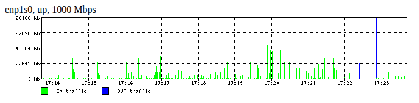

# ifbwgraph - High resolution network interfaces bandwidth graphs



HTTP daemon listening on 127.0.0.1 port 8080.

## Usage

```sh
$ ./ifbwgraph -h
./ifbwgraph network interface bandwidth graphs as HTTP server
Usage: ./ifbwgraph [options]
    -h           - this help
    -d [file]    - interface description file (line format "<ifname> = <description>")
                   Use full path to file, daemonized process change self CWD to "/".
    -l [address] - listening address (default 127.0.0.1)
    -p [port]    - listening port (default 8080)
```

Run `cp ifaces.txt /dev/shm/ && ./ifbwgraph -d /dev/shm/ifaces.txt`.
